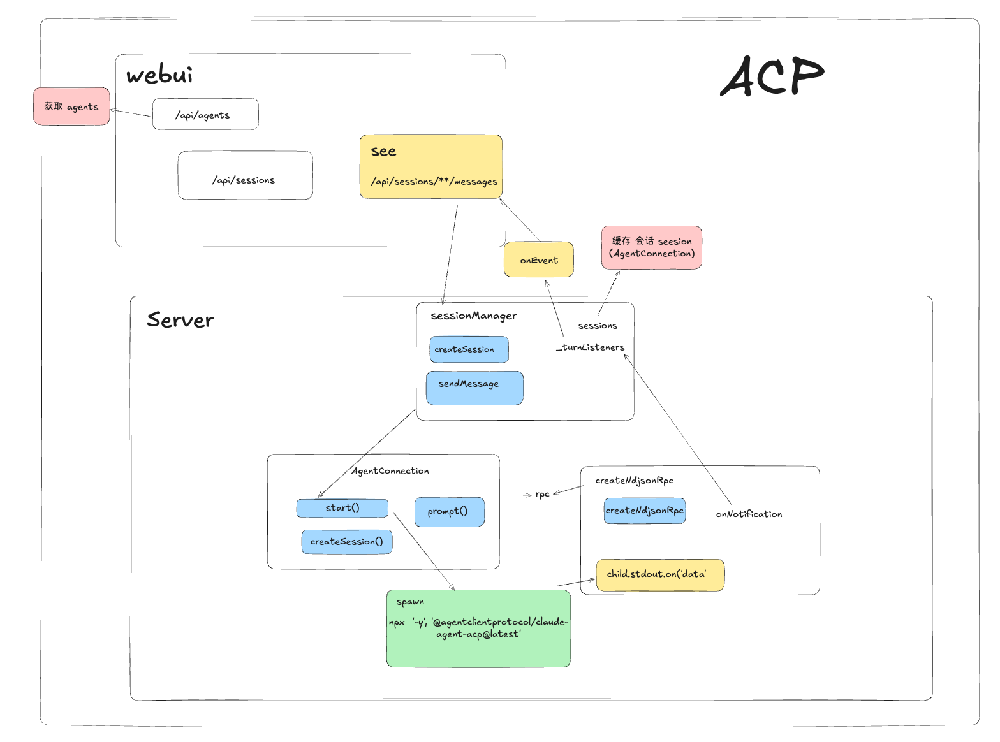

# ACP Web MVP



用 **Node.js + 静态 HTML** 做的最小对话台：通过 **ACP** 连接本机 **Claude** / **Codex**。

```text
浏览器  --HTTP/SSE-->  Node 服务（ACP Client）
                           |
                      spawn + stdio
                           |
                 claude-agent-acp / codex-acp
```


有意做小：没有 agents-chat 的登录、多 Agent 编排、SQLite、Relay。

## 目录职责（单一职责）

| 路径 | 职责 |
|------|------|
| `src/server.js` | 监听端口、静态资源、退出清理 |
| `src/routes/api.js` | 仅 REST + SSE 映射 |
| `src/config/agents.js` | Agent 启动命令与 cwd/env |
| `src/acp/rpc.js` | 子进程 NDJSON-RPC |
| `src/acp/hostHandlers.js` | 权限 / 文件 / 终端反向请求 |
| `src/acp/agentConnection.js` | 单 Agent：initialize、session、prompt |
| `src/acp/sessionManager.js` | 浏览器 sessionId ↔ 连接 |
| `public/index.html` | 对话 UI |

代码注释为中文。

## 前置条件

- Node.js >= 20
- 首次 `npx` 需能下载 ACP 适配器
- 本机 Claude / Codex 鉴权可用，例如：
  - Claude：`ANTHROPIC_API_KEY` 或适配器要求的登录方式
  - Codex：Codex CLI 已登录 / `OPENAI_API_KEY` 等

可选环境变量：

| 变量 | 含义 |
|------|------|
| `PORT` | 默认 `3920` |
| `HOST` | 默认 `127.0.0.1` |
| `ACP_CWD` | 前端未填 cwd 时的默认工作目录 |
| `CODEX_ACP_PACKAGE` | 覆盖 Codex 适配器 npm 包名 |
| `ANTHROPIC_API_KEY` | 传入 Claude 子进程 |
| `OPENAI_API_KEY` | 传入 Codex 子进程 |

## 启动

```bash
cd /acp-web-mvp
npm start
```

浏览器打开 `http://127.0.0.1:3920`

1. 选择 Claude 或 Codex  
2. 可选填写 cwd（Agent 工作目录）  
3. **新建会话**（spawn、`initialize`、`session/new`）  
4. 发消息（SSE 推 text / thinking / tool）

## API

```http
GET  /api/agents
POST /api/sessions          { "agentType": "claude"|"codex", "cwd?": "..." }
GET  /api/sessions/:id
DELETE /api/sessions/:id
POST /api/sessions/:id/messages   { "text": "..." }   → text/event-stream
```

SSE 事件名：`status`、`thinking`、`text`、`tool_start`、`tool_complete`、`done`、`error`。

## 设计说明

- Web 流式用 **SSE**（不是 poll）。子进程 `session/update` 推进当前 SSE 响应。
- 权限 **自动允许**（MVP）。不要对着敏感目录跑不可信提示词。
- **一个浏览器会话 = 一个 Agent 操作系统进程**。结束会话会 kill 进程。
- 新建会话后第一条消息可能较慢（`npx` 拉包）。


Node 做 ACP **Client**，适配器做 ACP **Agent**。


